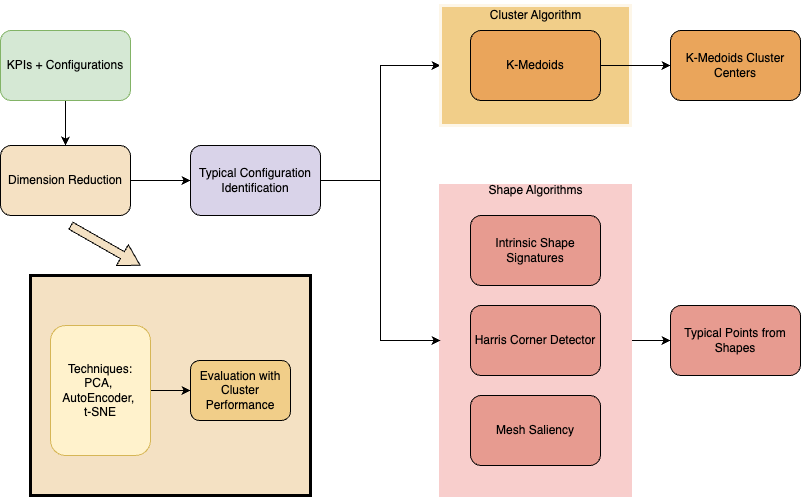
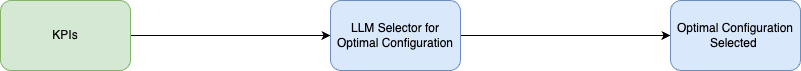
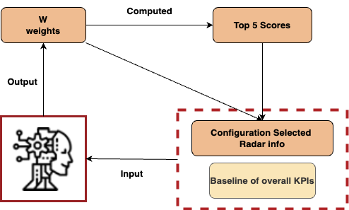
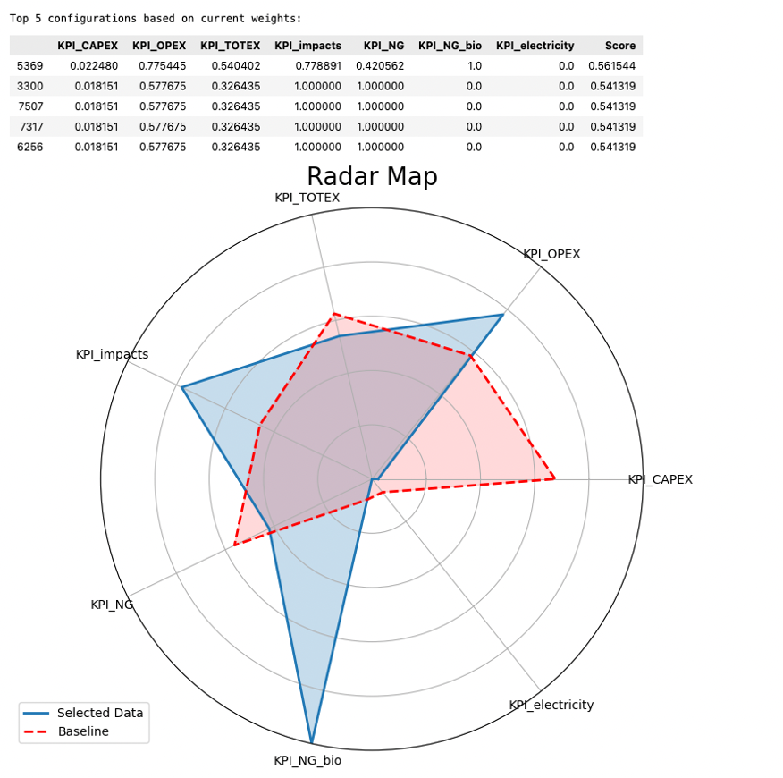
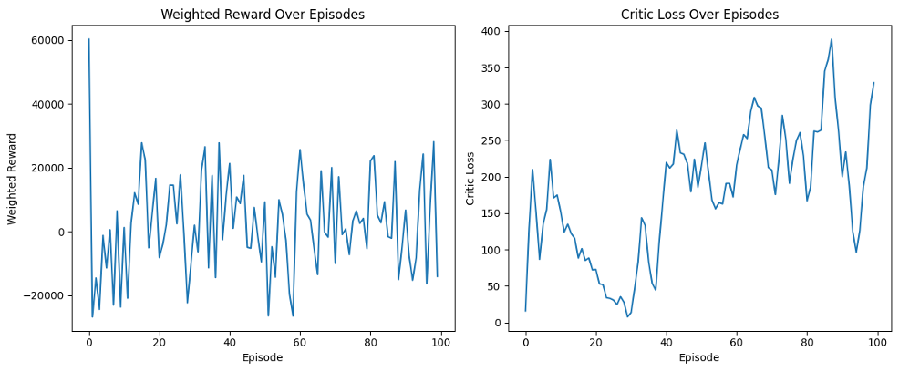
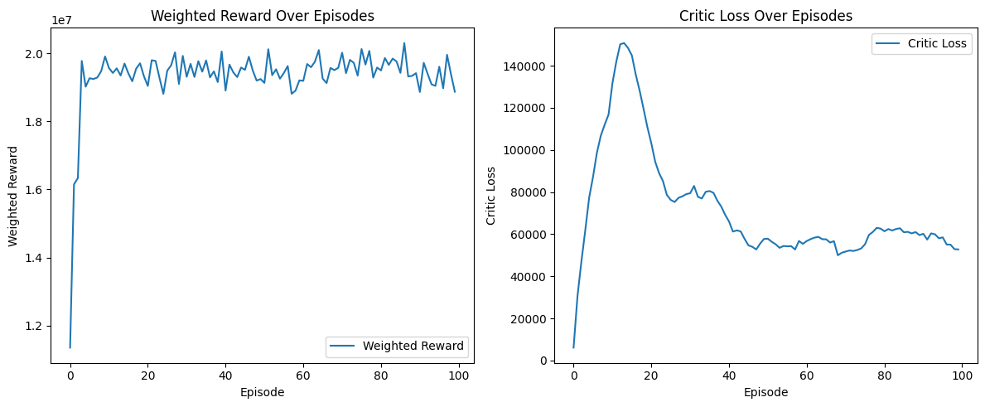

# Internship in IPESE lab


  

The internship project in EPFL IPESE lab

Author: 
Heyuan Liu 

M2 MSc&T AiViC student @ École Polytechnique 

Email: heyuan.liu@polytechnique.edu 

Title: Identify optimal configuration with a machine learning method in multi-criteria decision analysis

Under Supervision of 

**Professor Francois Maréchal** and **Mr. Yi Zhao** @ Industrial Process Energy System Engineering (IPESE) lab in EPFL

------

# Shape Algorithms for Typical Solution Identifications
### To Be Completed

Data Format is ruled

***Original Dataset is not available for now and we are considering to add a small scale of data.***

***Coming soon***





In the Folder of 16000Experiment, There are several Python files which are components of the Typical Solution Selectors. 

Including functions for
  - **ISS**
  - **Mesh Saliency**
  - **Harris Corner Detector in 3D**

And you could find the visualization functions in Visualization.ipynb, which is a Jupyter Notebook for a better visualizations in data sicence.

Before You get started, please make sure about that you have the Python environment on your computer. This part is developed under Python 3.7.8, and no clear differences with higher edition of the Python.

## Install necessary packages 
Go to the Folder 16000Experiment and run the following command in Terminal

```bash
pip install -r requirements.txt
```
## Give it A GO
With the Environment established, 

RUN in Ternimal
```bash
python main.py
```

Remember to set up the preferences of the iteration numbers. Actually the points selected by each iteration could be considered as Typical, because of the redundancy of the repeated configurations and super close distributions.

## Uses LLM to explain the Configurations selected

In the Notebook **LLM4Explain**, you could find the code for explanation with LLM.

**Note**
 - the code requires a OpenAI API key, which could be obtained from the OpenAI website.
 - Run with a virtual environment with Anaconda is recommended.

**Environment**
 - Python 3.9.19
 - OpenAI 1.12.0


------
# LLM aided Decision Making

Organizing, and will be deployed soon.

**Note**
 - the code requires a OpenAI API key, which could be obtained from the OpenAI website.
 - Run with a virtual environment with Anaconda is recommended.

**Environment**
 - Python 3.9.19
 - OpenAI 1.12.0



First, make sure about you have a OpenAI API key.




We enable the LLM (GPT4o from OpenAI) to interact with the data iteratively, based on the representations from the radar map to modify the strategy of assignment of the weights to achieve the convergence of the most optimal configurations with specific preferences in human's insights.

In some random iterations with Impact Oriented Multi Criteria Decision Analysis.


------


# Reinforcement Learning for Real-Time Multi-Objective Control

Stored in the RL.ipynb.

It still a raw code file, working on how to make it more clear.

Environment established by OpenAI Gym.

The **Multi-head Attention Mechanism** and **Shared Layer + Individual Layer** Design within **DDPG** framework safeguards the configuration units control with changing market conditions and reach zero violations


And for the curves of the training procedure,
We divided into two experiments test on the same conditions.
 - The first experiment is only based on **Shared Layer + Individual Layer**
 - The second experiment is plus the **Multi-head Attention Mechanism**


With Multiple Objectives Oriented Reward functions. And the variables in environment are all varied respect to the normal distribution.

**Shared & Individual Layer only**



**Shared & Individual Layer + Multi-head Attention Mechanism**


